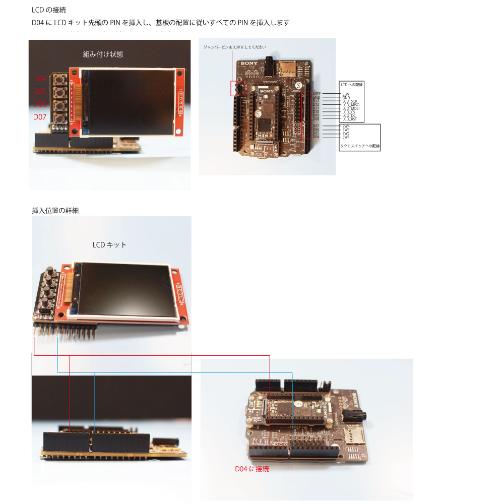

# Mic&LCD KIT for SPRESENSES サポートページ

## 概要
本キットをSPRESENSEに接続することで
マイク4本、LCDとスイッチ4つを実装することができ、
アプリケーションの開発を行うことができます

*SPRESENSEおよび、拡張基板、カメラ基板は付属しません

## 同梱物

## 使い方
### 1.SPRESENSEをご用意ください

SPRESENSE本体と拡張基板をご用意ください

*本キットには含まれておりません

### 2.LCDを接続

### 2.MICを接続

付属しているマイクは、アナログマイクです

音声の録音、スルーに使用する通常はMIC_AとMIC_Bの２箇所に接続して使用してください

*４箇所接続すると録音やスルーが動作しない場合があるようです
詳細はSPRESENSEの公式ドキュメントをご確認ください

https://developer.sony.com/develop/spresense/docs/hw_docs_ja.html

FFTアナライザなどのアプリケーションの場合は４箇所接続してご使用いただくことも可能です

FFTアナライザを自作されている方がいらっしゃったので参考までにご紹介します

*弊社はこちらのプログラムのサポートはできませんので、ご了承ください

https://github.com/TE-YoshinoriOota/Spresense_fftanalyzer_sample