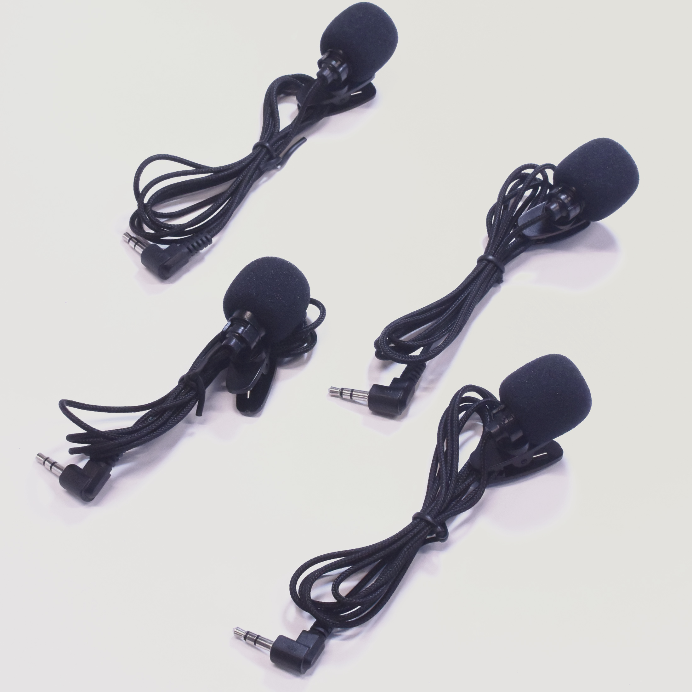

# Mic&LCD KIT for SPRESENSES サポートページ

## 概要
本キットをSPRESENSEに接続することで
マイク4本、LCDとスイッチ4つを実装することができ、
アプリケーションの開発を行うことができます

## 同梱物

## 使い方
### 1.SPRESENSEとの接続
SPRESENSE本体と拡張基板をご用意ください

SONYのロゴが見える向きから、
以下の位置にそれぞれKITを取り付けます

### 2.MICを接続
アナログマイクですので、音声の録音、スルーに使用する通常はMIC　AとMIC Bの２箇所に接続して使用してください
*４箇所接続すると録音やスルーが動作しないようです

FFTアナライザなどのアプリケーションの場合は４箇所接続してご使用いただくことも可能です
