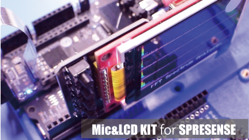
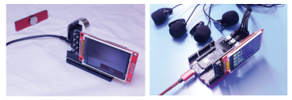
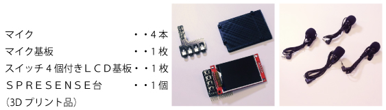
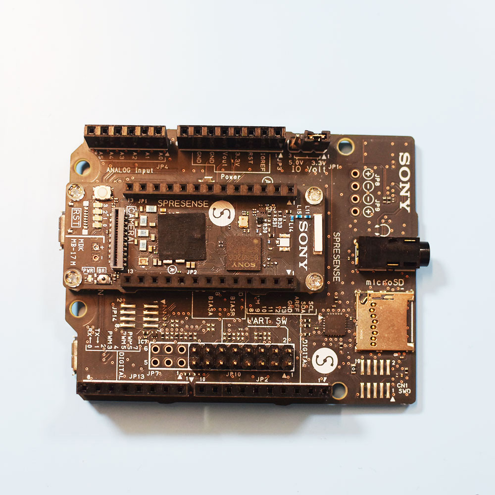
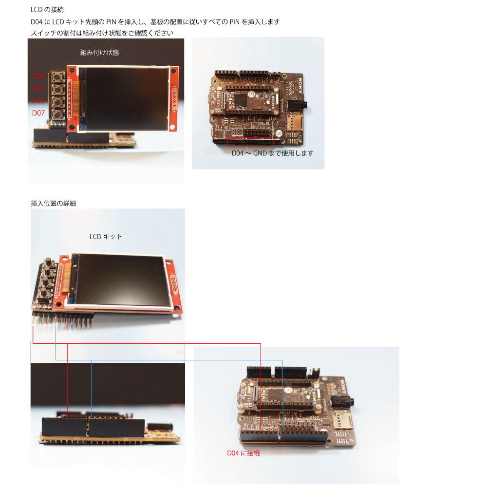
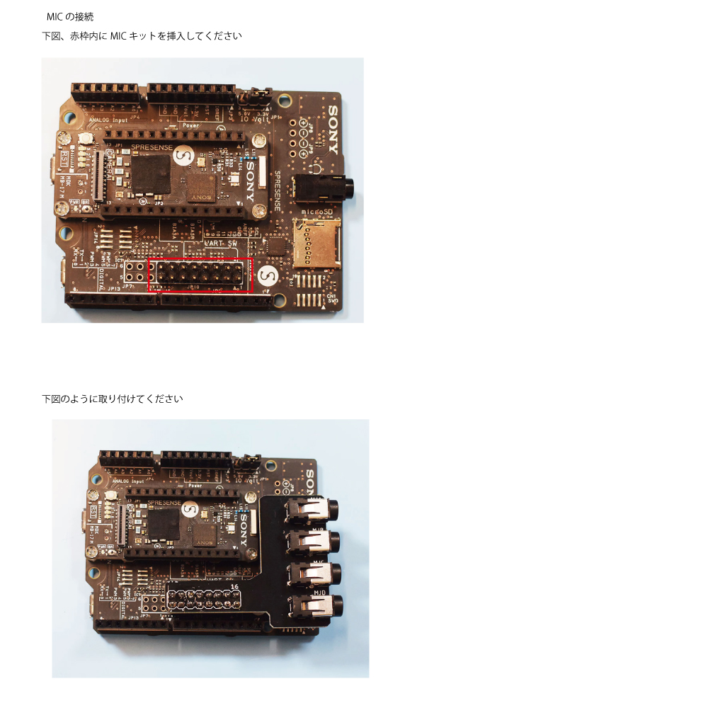

# Mic&LCD KIT for SPRESENSES サポートページ

## 概要
本キットをSPRESENSEに接続することで
マイク4本、LCDとスイッチ4つを実装することができ、
アプリケーションの開発を行うことができます

*SPRESENSEおよび、拡張基板、カメラ基板は付属しません

## 同梱物

## 使い方
### 1.SPRESENSEをご用意ください

SPRESENSE本体と拡張基板をご用意ください

*本キットには含まれておりません

### 2.LCDを接続

### 2.MICを接続
アナログマイクですので、音声の録音、スルーに使用する通常はMIC_AとMIC_Bの２箇所に接続して使用してください
*４箇所接続すると録音やスルーが動作しないようです

FFTアナライザなどのアプリケーションの場合は４箇所接続してご使用いただくことも可能です
